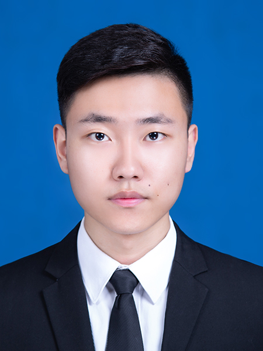

# 欢迎访问周勇主页
<table border="0">
  <tr>
    <td width="75%">
      <h1>周勇</h1>
      
<b>硕士研究生</b>

      
<b>南京邮电大学大学通信工程学院</b>

      
<b>邮箱：z751269425@163.com</b>

      
<b>地址：南京市新模范马路66号，综合科研楼，邮编210003 </b>

    </td>
    <td width="25%">
            
    </td>
  </tr>
</table>

# 教育经历
- 2015-2019 南京晓庄学院电子信息本科
- 2019-2022 南京邮电大学通信硕士

# 项目
- 开关电源并联供电系统
- 电能收集充电器
- 单相用电器分析监测装置
- 基于格雷码立体视觉
- 基于百度云API与树莓派人脸识别系统
- 基于卡尔曼滤波平衡小车
- 基于局部梯度约束的红外可见光融合相机

# 荣誉
- 2018年国家奖学金
- 2017年国家励志奖学金
- 南京晓庄学院优秀毕业生
- 第八届全国大学生数学竞赛（江苏赛区）一等奖
- 第十四届江苏省数学竞赛（本科一级组）一等奖
- 第十三届江苏省数学竞赛（本科三级组）一等奖
- 2017全国大学生英语竞赛C类二等奖
- 2017全国大学生电子设计大赛江苏赛区二等奖
- 江苏省机器人大赛二等奖

